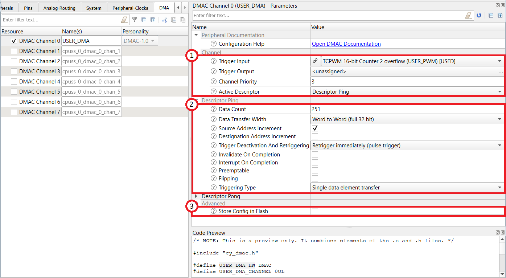
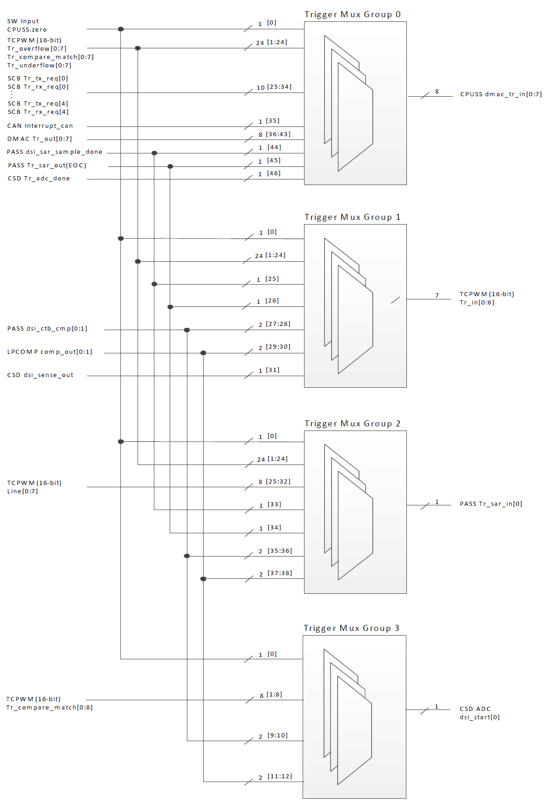

# PSoC&trade; 4: PWM triggering a DMA channel

This example demonstrates how to route trigger signals on a PSoC&trade; 4 device. The trigger signal, in this code example, is routed from the PWM to the DMA, using the device configurator.

[View this README on GitHub.](https://github.com/Infineon/mtb-example-psoc4-pwm-trigger-dma)

[Provide feedback on this code example.](https://cypress.co1.qualtrics.com/jfe/form/SV_1NTns53sK2yiljn?Q_EED=eyJVbmlxdWUgRG9jIElkIjoiQ0UyMzE3MzIiLCJTcGVjIE51bWJlciI6IjAwMi0zMTczMiIsIkRvYyBUaXRsZSI6IlBTb0MmdHJhZGU7IDQ6IFBXTSB0cmlnZ2VyaW5nIGEgRE1BIGNoYW5uZWwiLCJyaWQiOiJ2c3JzIiwiRG9jIHZlcnNpb24iOiIyLjAuMCIsIkRvYyBMYW5ndWFnZSI6IkVuZ2xpc2giLCJEb2MgRGl2aXNpb24iOiJNQ0QiLCJEb2MgQlUiOiJJQ1ciLCJEb2MgRmFtaWx5IjoiUFNPQyJ9)

## Requirements

- [ModusToolbox&trade; software](https://www.infineon.com/modustoolbox) v3.0 or later (tested with v3.0)

  **Note:** This code example version requires ModusToolbox&trade; software version 3.0 or later and is not backward compatible with v2.4 or older versions.

- Board support package (BSP) minimum required version: 3.0.0
- Programming language: C
- Associated parts: [PSoC&trade; 4100S Plus, PSoC&trade; 4500S and PSoC&trade; 4100S Max](https://www.infineon.com/cms/en/product/microcontroller/32-bit-psoc-arm-cortex-microcontroller/psoc-4-32-bit-arm-cortex-m0-mcu/)

## Supported toolchains (make variable 'TOOLCHAIN')

- GNU Arm&reg; embedded compiler v10.3.1 (`GCC_ARM`) - Default value of `TOOLCHAIN`
- Arm&reg; compiler v6.16 (`ARM`)
- IAR C/C++ compiler v9.30.1 (`IAR`)

## Supported kits (make variable 'TARGET')

- [PSoC&trade; 4100S Max pioneer kit](https://www.infineon.com/CY8CKIT-041S-MAX) (`CY8CKIT-041S-MAX`) - Default value of `TARGET`
- [PSoC&trade; 4100S Plus prototyping kit](https://www.infineon.com/CY8CKIT-149) (`CY8CKIT-149`)
- [PSoC&trade; 4500S pioneer kit](https://www.infineon.com/CY8CKIT-045S) (`CY8CKIT-045S`)


## Hardware setup

This example uses the board's default configuration. See the kit user guide to ensure that the board is configured correctly.

**Note:** The PSoC&trade; 4 kits ship with KitProg2 installed. The ModusToolbox&trade; software requires KitProg3. Before using this code example, make sure that the board is upgraded to KitProg3. The tool and instructions are available in the [Firmware Loader](https://github.com/Infineon/Firmware-loader) GitHub repository. If you do not upgrade, you will see an error like "unable to find CMSIS-DAP device" or "KitProg firmware is out of date".


## Software setup

This example requires no additional software or tools.

## Using the code example

Create the project and open it using one of the following:

<details><summary><b>In Eclipse IDE for ModusToolbox&trade; software</b></summary>

1. Click the **New Application** link in the **Quick Panel** (or, use **File** > **New** > **ModusToolbox&trade; Application**). This launches the [Project Creator](https://www.infineon.com/ModusToolboxProjectCreator) tool.

2. Pick a kit supported by the code example from the list shown in the **Project Creator - Choose Board Support Package (BSP)** dialog.

   When you select a supported kit, the example is reconfigured automatically to work with the kit. To work with a different supported kit later, use the [Library Manager](https://www.infineon.com/ModusToolboxLibraryManager) to choose the BSP for the supported kit. You can use the Library Manager to select or update the BSP and firmware libraries used in this application. To access the Library Manager, click the link from the **Quick Panel**.

   You can also just start the application creation process again and select a different kit.

   If you want to use the application for a kit not listed here, you may need to update the source files. If the kit does not have the required resources, the application may not work.

3. In the **Project Creator - Select Application** dialog, choose the example by enabling the checkbox.

4. (Optional) Change the suggested **New Application Name**.

5. The **Application(s) Root Path** defaults to the Eclipse workspace which is usually the desired location for the application. If you want to store the application in a different location, you can change the *Application(s) Root Path* value. Applications that share libraries should be in the same root path.

6. Click **Create** to complete the application creation process.

For more details, see the [Eclipse IDE for ModusToolbox&trade; software user guide](https://www.infineon.com/MTBEclipseIDEUserGuide) (locally available at *{ModusToolbox&trade; software install directory}/docs_{version}/mt_ide_user_guide.pdf*).

</details>

<details><summary><b>In command-line interface (CLI)</b></summary>

ModusToolbox&trade; software provides the Project Creator as both a GUI tool and the command line tool, "project-creator-cli". The CLI tool can be used to create applications from a CLI terminal or from within batch files or shell scripts. This tool is available in the *{ModusToolbox&trade; software install directory}/tools_{version}/project-creator/* directory.

Use a CLI terminal to invoke the "project-creator-cli" tool. On Windows, use the command line "modus-shell" program provided in the ModusToolbox&trade; software installation instead of a standard Windows command-line application. This shell provides access to all ModusToolbox&trade; software tools. You can access it by typing `modus-shell` in the search box in the Windows menu. In Linux and macOS, you can use any terminal application.

This tool has the following arguments:

Argument | Description | Required/optional
---------|-------------|-----------
`--board-id` | Defined in the `<id>` field of the [BSP](https://github.com/Infineon?q=bsp-manifest&type=&language=&sort=) manifest | Required
`--app-id`   | Defined in the `<id>` field of the [CE](https://github.com/Infineon?q=ce-manifest&type=&language=&sort=) manifest | Required
`--target-dir`| Specify the directory in which the application is to be created if you prefer not to use the default current working directory | Optional
`--user-app-name`| Specify the name of the application if you prefer to have a name other than the example's default name | Optional

<br />

The following example clones the "[mtb-example-psoc4-pwm-trigger-dma](https://github.com/Infineon/mtb-example-psoc4-pwm-trigger-dma)" application with the desired name "Psoc4TriggerDma" configured for the *CY8CKIT-149* BSP into the specified working directory, *C:/mtb_projects*:

   ```
   project-creator-cli --board-id CY8CKIT-149 --app-id mtb-example-psoc4-pwm-trigger-dma --user-app-name Psoc4TriggerDma --target-dir "C:/mtb_projects"
   ```

**Note:** The project-creator-cli tool uses the `git clone` and `make getlibs` commands to fetch the repository and import the required libraries. For details, see the "Project creator tools" section of the [ModusToolbox&trade; software user guide](https://www.infineon.com/ModusToolboxUserGuide) (locally available at *{ModusToolbox&trade; software install directory}/docs_{version}/mtb_user_guide.pdf*).

To work with a different supported kit later, use the [Library Manager](https://www.infineon.com/ModusToolboxLibraryManager) to choose the BSP for the supported kit. You can invoke the Library Manager GUI tool from the terminal using `make library-manager` command or use the Library Manager CLI tool "library-manager-cli" to change the BSP.

The "library-manager-cli" tool has the following arguments:

Argument | Description | Required/optional
---------|-------------|-----------
`--add-bsp-name` | Name of the BSP that should be added to the application | Required
`--set-active-bsp` | Name of the BSP that should be as active BSP for the application | Required
`--add-bsp-version`| Specify the version of the BSP that should be added to the application if you do not wish to use the latest from manifest | Optional
`--add-bsp-location`| Specify the location of the BSP (local/shared) if you prefer to add the BSP in a shared path | Optional

<br />

Following example adds the CY8CKIT-041S-MAX BSP to the already created application and makes it the active BSP for the app:

   ```
   library-manager-cli --project "C:/mtb_projects/Psoc4TriggerDma" --add-bsp-name CY8CKIT-041S-MAX --add-bsp-version "latest-v3.X" --add-bsp-location "local"

   library-manager-cli --project "C:/mtb_projects/Psoc4TriggerDma" --set-active-bsp APP_CY8CKIT-041S-MAX
   ```

</details>

<details><summary><b>In third-party IDEs</b></summary>

Use one of the following options:

- **Use the standalone [Project Creator](https://www.infineon.com/ModusToolboxProjectCreator) tool:**

   1. Launch Project Creator from the Windows Start menu or from *{ModusToolbox&trade; software install directory}/tools_{version}/project-creator/project-creator.exe*.

   2. In the initial **Choose Board Support Package** screen, select the BSP, and click **Next**.

   3. In the **Select Application** screen, select the appropriate IDE from the **Target IDE** drop-down menu.

   4. Click **Create** and follow the instructions printed in the bottom pane to import or open the exported project in the respective IDE.

<br />

- **Use command-line interface (CLI):**

   1. Follow the instructions from the **In command-line interface (CLI)** section to create the application.

   2. Export the application to a supported IDE using the `make <ide>` command.

   3. Follow the instructions displayed in the terminal to create or import the application as an IDE project.

For a list of supported IDEs and more details, see the "Exporting to IDEs" section of the [ModusToolbox&trade; software user guide](https://www.infineon.com/ModusToolboxUserGuide) (locally available at *{ModusToolbox&trade; software install directory}/docs_{version}/mtb_user_guide.pdf*).

</details>


## Operation

In this example, the intensity of the LED is controlled by changing the duty cycle of the PWM signal. The PWM duty cycle is updated using DMA. The duty cycle is updated in such a way that a breathing pattern is seen on the LED.

1. Connect the board to your PC using the provided USB cable through the USB connector.

2. Program the board using one of the following:

   <details><summary><b>Using Eclipse IDE for ModusToolbox&trade; software</b></summary>

      1. Select the application project in the Project Explorer.

      2. In the **Quick Panel**, scroll down, and click **\<Application Name> Program (KitProg3_MiniProg4)**.
   </details>

   <details><summary><b>Using CLI</b></summary>

     From the terminal, execute the `make program` command to build and program the application using the default toolchain to the default target. The default toolchain is specified in the application's Makefile but you can override this value manually:
      ```
      make program TOOLCHAIN=<toolchain>
      ```

      Example:
      ```
      make program TOOLCHAIN=GCC_ARM
      ```
   </details>

3. See the breathing output on the user LED.

## Debugging

You can debug the example to step through the code. In the IDE, use the **\<Application Name> Debug (KitProg3_MiniProg4)** configuration in the **Quick Panel**. For details, see the "Program and debug" section in the [Eclipse IDE for ModusToolbox&trade; software user guide](https://www.infineon.com/MTBEclipseIDEUserGuide).

## Design and implementation

The PSoC&trade; 4 device has many digital signals generated from different peripheral blocks. Many of these signals would need to be routed to other peripheral blocks as triggers to some events there. Trigger multiplexers are simple multiplexers that are designed to route these signals from potential source peripherals to destinations. This example demonstrates setting up a trigger route from the PWM to the DMA.

The design implements a PWM that has a duty cycle that is updated on every terminal count of the PWM through a DMA. There is a preset list of compare values in an array. These preset compare values are in a format that, when updated as the compare value of the PWM in every cycle, will generate a breathing pattern. The array with compare values is the source of data transfer for the DMA; the destination is the PWM’s compare register. The DMA is triggered using the PWM’s terminal count signal. The routing of the terminal count signal to the trigger input of the DMA is accomplished using the trigger multiplexer.

You need to connect the PWM overflow trigger (ovrflw) to the DMA input trigger (tr_in). The ModusToolbox&trade; software device configurator  takes care of generating the code responsible for routing the trigger signal. See [Trigger multiplexer](#trigger-multiplexer).

### Resources and settings

**Table 1. Application resources**

 Resource          |  Alias/object     |    Purpose
 :---------------- | :---------------- | :--------------------
 TCPWM (PWM)       | USER_PWM         | PWM to drive the user LED
 DMA               | USER_DMA         | DMA channel to update the PWM compare value
 GPIO              | CYBSP_USER_LED1   | LED to show the output

<br>

## Resource settings

### DMA configuration

A DMA channel is used to transfer the compare values from the array to the PWM compare register. The configuration is shown in Figure 1.

**Figure 1. DMA configuration**



The trigger input to the DMA is connected to the PWM overflow trigger output. The trigger output is not used. Descriptor Ping is retained as the active descriptor.

The DMA implements a simple array to a single register transfer, which can be achieved by using a single descriptor. Only the ping descriptor is required in this case. This descriptor transfers a 251- element array to a single compare register over 251 triggers. Therefore, the data count is set as 251. Because the data source is an array, the address needs to be incremented after each transfer. Therefore, the source address increment is set. The destination is a constant compare register. Therefore, destination increment is not set.

The ping descriptor source and destinations are dynamically updated in the code. Therefore, it is not stored in flash.


### TCPWM configuration


**Figure 2. TCPWM configuration**


The period value of the PWM is set to 65532. The PWM is clocked by a 12-MHz clock and the terminal count is used to trigger the DMA. This period value (65532) ensures that the terminal count and consequently the DMA trigger occurs at a frequency of 12/65532 MHz. The breathing rate of the LED will be determined by this rate of DMA trigger multiplied by the number of elements in the array of compared values.

The compare value is set to 256 here. However, the compare value is updated later using this DMA. Therefore, this value starts the PWM at a very small duty cycle.


## Trigger multiplexer

The DMA channels can have trigger inputs from different peripheral sources in the PSoC&trade; device. This is routed to the individual DMA channel trigger inputs through the trigger multiplexer. In the DMA trigger, multiplexers are organized into trigger groups. Each trigger group is composed of multiple multiplexers feeding into the individual DMA channel trigger inputs.

The routing of the trigger is achieved by configuring a single trigger group (Trigger group 0), which provides trigger inputs to the DMA.

**Figure 3. Trigger multiplexer architecture**



ModusToolbox&trade; software's device configurator automatically generates the code required to trigger multiplexer routing. This trigger multiplexer routing code is in *cycfg_routing.c* as a part of the `cybsp_init()` function. The following code snippet is from the `cybsp_init()` function of this code example; it shows the `Cy_TrigMux_Connect()` call to connect the PWM overflow output trigger to the DMA input trigger.

```c
Cy_TrigMux_Connect(TRIG0_IN_TCPWM_TR_OVERFLOW2, TRIG0_OUT_CPUSS_DMAC_TR_IN0);
```

## Related resources

Resources  | Links
-----------|----------------------------------
Application notes | [AN79953](https://www.infineon.com/AN79953) – Getting started with PSoC&trade; 4
Device documentation | [PSoC&trade; 4 product page](https://www.infineon.com/cms/en/product/microcontroller/32-bit-psoc-arm-cortex-microcontroller/psoc-4-32-bit-arm-cortex-m0-mcu)
Code examples  | [Using ModusToolbox&trade; software](https://github.com/Infineon/Code-Examples-for-ModusToolbox-Software) on GitHub <br> [Using PSoC&trade; Creator](https://www.infineon.com/cms/en/design-support/software/code-examples/psoc-3-4-5-code-examples-for-psoc-creator)
Development kits | Select your kits from the [Evaluation board finder](https://www.infineon.com/cms/en/design-support/finder-selection-tools/product-finder/evaluation-board) page
Libraries | [mtb-pdl-cat2](https://github.com/Infineon/mtb-pdl-cat2) – PSoC&trade; 4 peripheral driver library (PDL) <br>  [mtb-hal-cat2](https://github.com/Infineon/mtb-hal-cat2) – Hardware abstraction layer (HAL) library
Tools  | [ModusToolbox&trade; software](https://www.infineon.com/modustoolbox) – ModusToolbox&trade; software is a collection of easy-to-use software and tools enabling rapid development with Infineon MCUs, covering applications from embedded sense and control to wireless and cloud-connected systems using AIROC&trade; Wi-Fi and Bluetooth® connectivity devices. <br> [PSoC&trade; Creator](https://www.infineon.com/cms/en/design-support/tools/sdk/psoc-software/psoc-creator) – IDE for PSoC&trade; and FM0+ MCU development <br> [PSoC&trade; Programmer](https://www.infineon.com/cms/en/design-support/tools/programming-testing/psoc-programming-solutions/) – A complete package that installs all components required for a programming and debug solution. In addition, it also installs Clock Programmer and  Bridge Control Panel

<br />

## Other resources

Infineon provides a wealth of data at www.infineon.com to help you select the right device, and quickly and effectively integrate it into your design.

## Document history

Document title: *CE231732* - *PSoC&trade; 4: PWM triggering a DMA channel*

 Version | Description of change
 ------- | ---------------------
 1.0.0   | New code example
 1.1.0   | Added support for new kits
 2.0.0   | Major update to support ModusToolbox&trade; v3.0. This version is not backward compatible with previous versions of ModusToolbox&trade; software.

<br />

---------------------------------------------------------

© Cypress Semiconductor Corporation, 2020-2022. This document is the property of Cypress Semiconductor Corporation, an Infineon Technologies company, and its affiliates ("Cypress").  This document, including any software or firmware included or referenced in this document ("Software"), is owned by Cypress under the intellectual property laws and treaties of the United States and other countries worldwide.  Cypress reserves all rights under such laws and treaties and does not, except as specifically stated in this paragraph, grant any license under its patents, copyrights, trademarks, or other intellectual property rights.  If the Software is not accompanied by a license agreement and you do not otherwise have a written agreement with Cypress governing the use of the Software, then Cypress hereby grants you a personal, non-exclusive, nontransferable license (without the right to sublicense) (1) under its copyright rights in the Software (a) for Software provided in source code form, to modify and reproduce the Software solely for use with Cypress hardware products, only internally within your organization, and (b) to distribute the Software in binary code form externally to end users (either directly or indirectly through resellers and distributors), solely for use on Cypress hardware product units, and (2) under those claims of Cypress’s patents that are infringed by the Software (as provided by Cypress, unmodified) to make, use, distribute, and import the Software solely for use with Cypress hardware products.  Any other use, reproduction, modification, translation, or compilation of the Software is prohibited.
<br />
TO THE EXTENT PERMITTED BY APPLICABLE LAW, CYPRESS MAKES NO WARRANTY OF ANY KIND, EXPRESS OR IMPLIED, WITH REGARD TO THIS DOCUMENT OR ANY SOFTWARE OR ACCOMPANYING HARDWARE, INCLUDING, BUT NOT LIMITED TO, THE IMPLIED WARRANTIES OF MERCHANTABILITY AND FITNESS FOR A PARTICULAR PURPOSE.  No computing device can be absolutely secure.  Therefore, despite security measures implemented in Cypress hardware or software products, Cypress shall have no liability arising out of any security breach, such as unauthorized access to or use of a Cypress product. CYPRESS DOES NOT REPRESENT, WARRANT, OR GUARANTEE THAT CYPRESS PRODUCTS, OR SYSTEMS CREATED USING CYPRESS PRODUCTS, WILL BE FREE FROM CORRUPTION, ATTACK, VIRUSES, INTERFERENCE, HACKING, DATA LOSS OR THEFT, OR OTHER SECURITY INTRUSION (collectively, "Security Breach").  Cypress disclaims any liability relating to any Security Breach, and you shall and hereby do release Cypress from any claim, damage, or other liability arising from any Security Breach.  In addition, the products described in these materials may contain design defects or errors known as errata which may cause the product to deviate from published specifications. To the extent permitted by applicable law, Cypress reserves the right to make changes to this document without further notice. Cypress does not assume any liability arising out of the application or use of any product or circuit described in this document. Any information provided in this document, including any sample design information or programming code, is provided only for reference purposes.  It is the responsibility of the user of this document to properly design, program, and test the functionality and safety of any application made of this information and any resulting product.  "High-Risk Device" means any device or system whose failure could cause personal injury, death, or property damage.  Examples of High-Risk Devices are weapons, nuclear installations, surgical implants, and other medical devices.  "Critical Component" means any component of a High-Risk Device whose failure to perform can be reasonably expected to cause, directly or indirectly, the failure of the High-Risk Device, or to affect its safety or effectiveness.  Cypress is not liable, in whole or in part, and you shall and hereby do release Cypress from any claim, damage, or other liability arising from any use of a Cypress product as a Critical Component in a High-Risk Device. You shall indemnify and hold Cypress, including its affiliates, and its directors, officers, employees, agents, distributors, and assigns harmless from and against all claims, costs, damages, and expenses, arising out of any claim, including claims for product liability, personal injury or death, or property damage arising from any use of a Cypress product as a Critical Component in a High-Risk Device. Cypress products are not intended or authorized for use as a Critical Component in any High-Risk Device except to the limited extent that (i) Cypress’s published data sheet for the product explicitly states Cypress has qualified the product for use in a specific High-Risk Device, or (ii) Cypress has given you advance written authorization to use the product as a Critical Component in the specific High-Risk Device and you have signed a separate indemnification agreement.
<br />
Cypress, the Cypress logo, and combinations thereof, WICED, ModusToolbox, PSoC, CapSense, EZ-USB, F-RAM, and Traveo are trademarks or registered trademarks of Cypress or a subsidiary of Cypress in the United States or in other countries. For a more complete list of Cypress trademarks, visit cypress.com. Other names and brands may be claimed as property of their respective owners.
